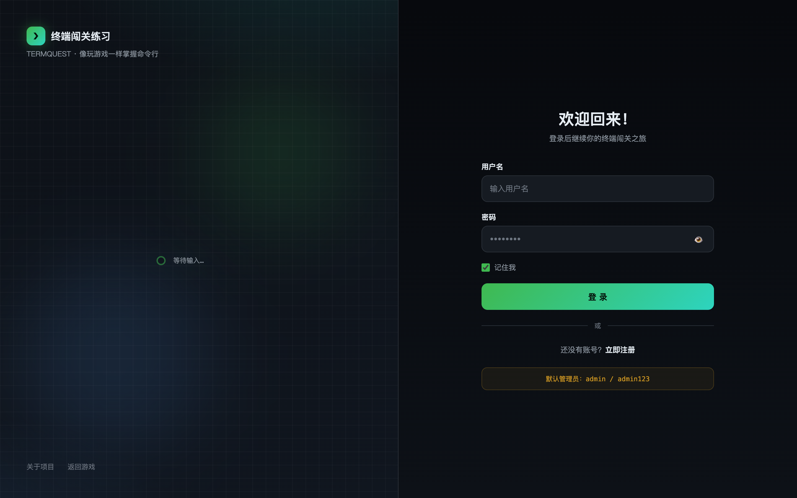
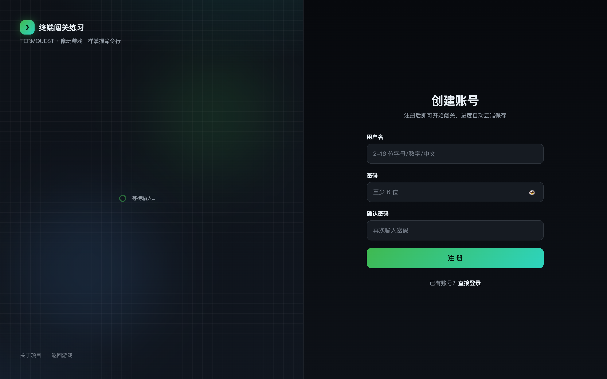
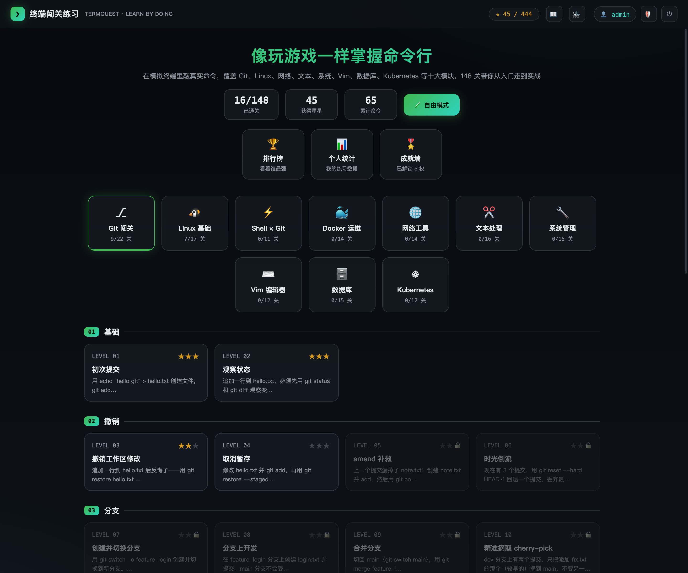
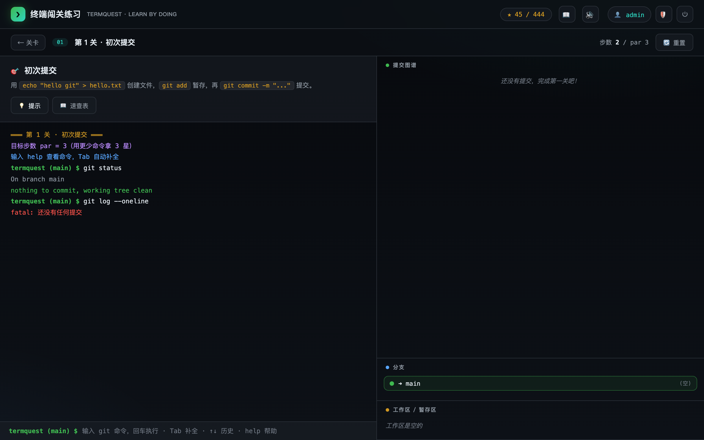
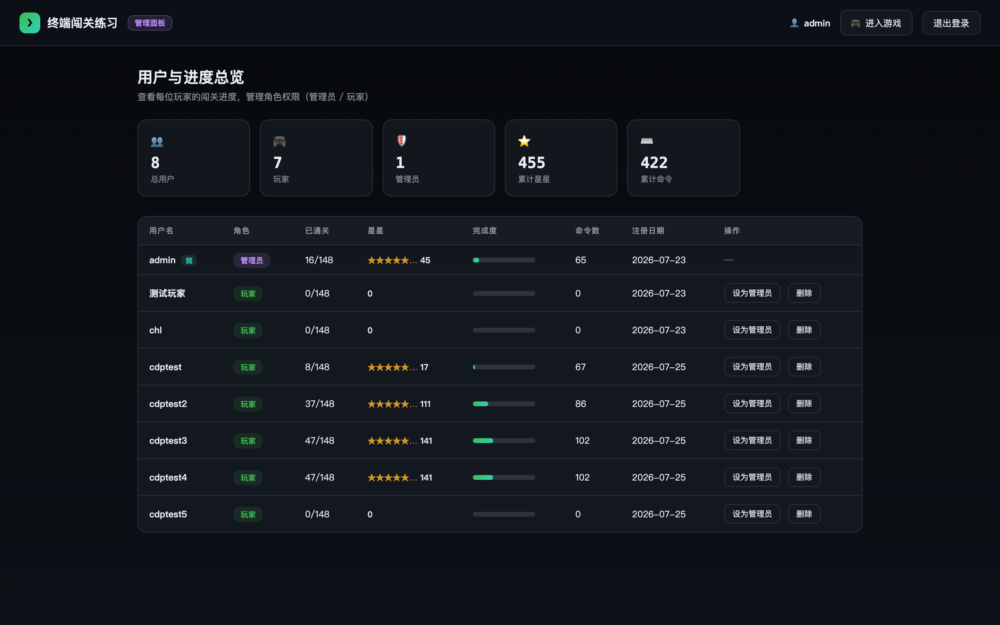

# TermQuest — 终端闯关练习

一个系统化的命令行练习仓库：既有按难度递进的 Git 专项练习，也有覆盖 Git / Linux / Shell / Docker 的互动闯关游戏。

---

## 🎮 互动闯关游戏

**线上体验：https://termquest-chls-projects-ddde4200.vercel.app**

在浏览器里通过**模拟终端**学习命令行——敲真实命令完成 47 个关卡，覆盖 Git、Linux、Shell 脚本与 Docker 运维四大模块。内置用户登录、排行榜、成就徽章、个人统计面板，并支持 GitHub 账号登录。

### 账号说明

| 账号 | 密码 | 角色 | 说明 |
|------|------|------|------|
| `admin` | `admin123` | 管理员 | 首次启动自动创建，拥有全部权限 |

- 普通玩家通过注册页自行创建账号（用户名 2–16 位字母/数字/中文/下划线，密码至少 6 位）
- 注册后即获得 `player` 角色，进度自动绑定账号云端保存
- 管理员可在管理面板中提升/降级角色、删除用户

### 界面预览

**登录页** — 左右分屏设计，左侧实时渲染 git 提交链动画，右侧为登录表单：



**注册页** — 注册后即可开始闯关，进度自动云端保存：



**游戏主页** — 17 个关卡按阶段分组，顶部显示星星进度、排行榜、个人统计和成就墙：



**闯关终端** — 左侧任务目标，右侧 SVG 提交图谱 + 分支列表 + 工作区状态，底部模拟终端支持 Tab 补全：



**管理面板**（仅管理员）— 查看全部用户通关数据，管理角色与用户：



### 本地运行

```bash
cd game
node server.js        # 零依赖，启动后自动打开 http://localhost:5188
```

启动后使用 **admin / admin123** 登录，或注册新账号开始闯关。

> 详细说明见 [`game/README.md`](game/README.md)

---

## 学习路线

| 阶段 | 目录 | 内容 | 难度 |
|------|------|------|------|
| 1 | `01-basics/` | init, config, add, commit, status, log, diff, show | ⭐ |
| 2 | `02-undo/` | restore, reset, revert, clean, amend | ⭐⭐ |
| 3 | `03-branching/` | branch, switch, merge, rebase, cherry-pick | ⭐⭐ |
| 4 | `04-remote/` | clone, remote, push, pull, fetch, tracking | ⭐⭐ |
| 5 | `05-stash-and-tags/` | stash, tag, release 管理 | ⭐⭐⭐ |
| 6 | `06-rewrite-history/` | interactive rebase, squash, fixup, reword, filter | ⭐⭐⭐⭐ |
| 7 | `07-conflicts/` | 冲突解决, merge 策略, rerere, ours/theirs | ⭐⭐⭐⭐ |
| 8 | `08-advanced/` | reflog, bisect, worktree, submodule, subtree, blame | ⭐⭐⭐⭐⭐ |
| 9 | `09-internals/` | 对象模型, plumbing 命令, refs, HEAD, packfile | ⭐⭐⭐⭐⭐ |

## 练习方法

每个目录下的 README 包含：
- **概念讲解** — 理解原理
- **命令速查** — 快速参考
- **动手练习** — 跟着做一遍

`exercises/` 目录提供场景脚本，运行后会自动构造特定的 git 状态供你练习解决。

## 建议

- 按顺序学习，每个阶段至少动手练两遍
- 遇到不确定的操作先 `git status` 确认状态
- 大胆实验，`git reflog` 是你的后悔药
- 练习分支操作时多画图理解指针移动
